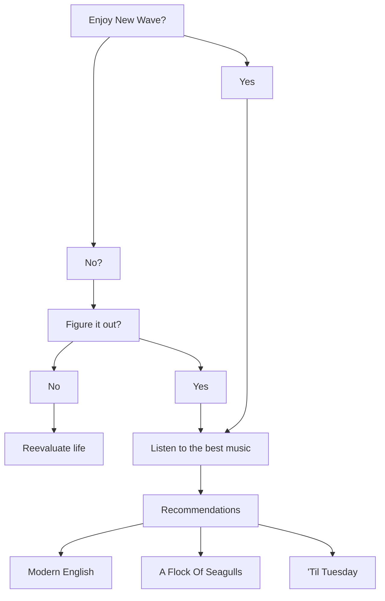

<h1>
<em><strong>Never Gonna Give You Up</em></strong></p1></h1>

<a href="https://www.youtube.com/watch?v=dQw4w9WgXcQ"> <button><strong>RICK=MasterClass2<strong></button></a> 

<a href="Defs_Not_Rick_Roll.gif">___Important___

<a href="experimentingfile.md">Grocery List</a>

